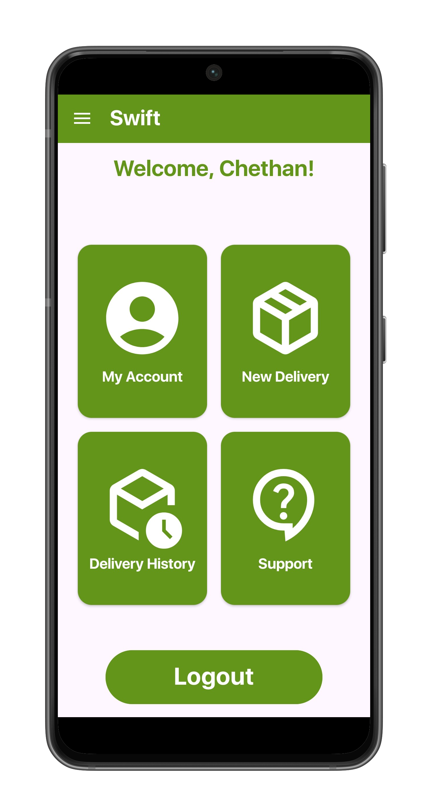
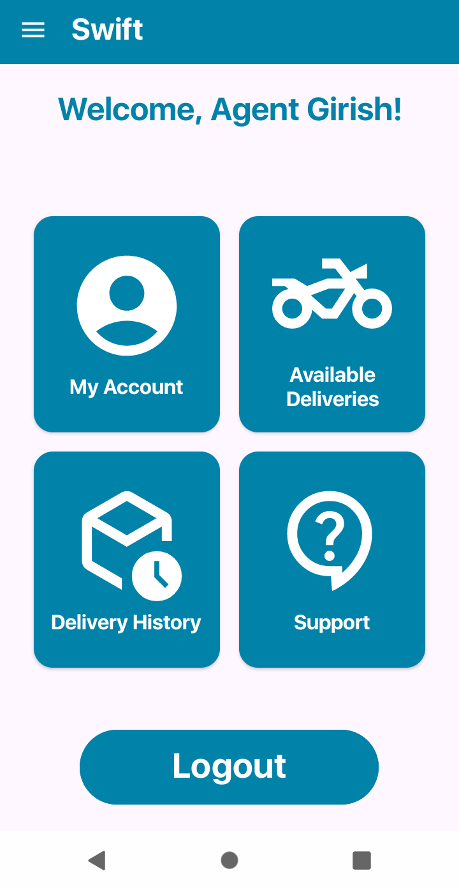
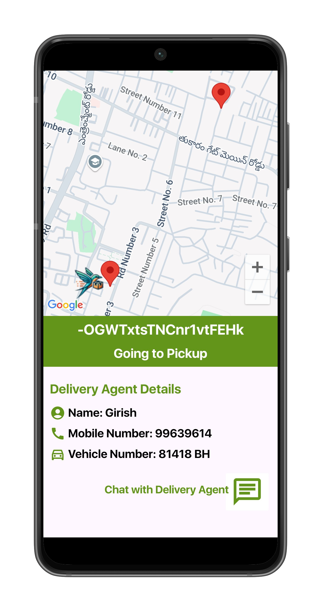
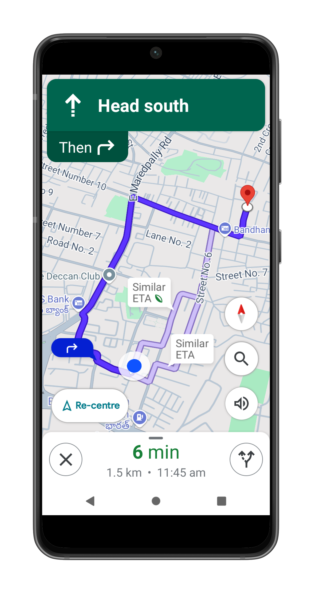
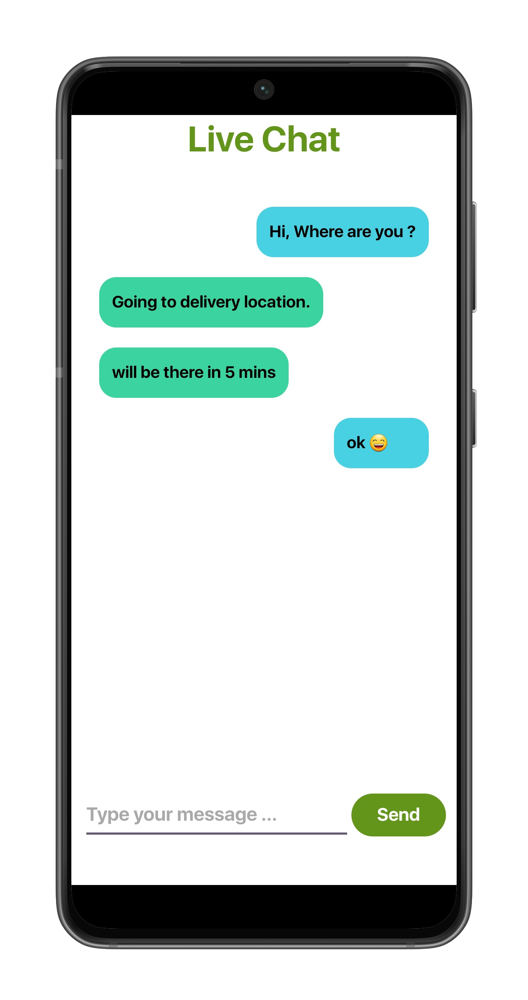

# **SWIFT**

### **DESCRIPTION**

Swift is an android mobile application developed using Java in Android Studio. The app provides door-to-door package delivery service with Realtime delivery location tracking to its users. The app leverages modern Android development practices, a clean UI, and intuitive user experience.

### ** 📱 FEATURES**

- User Authentication via Firebase
- User Profile Management
- Google Maps API Integration
- Live Location Tracking
- Delivery Route Navigation
- Real-time messaging
- Secure data handling 
- Admin Features 
- App Analytics

### ** 🛠️ TOOLS**

- Android Studio
- Java Programming
- Google Firebase Realtime Database
- Google Maps API
- Google Directions API
- Material UI components
- Model View Controller (MVC) architecture

### ** 📁 PROJECT STRUCTURE**

Swift/
├── app/
│   ├── src/
│   │   ├── main/
│   │   │   ├── java/
│   │   │   │   └── com.example.swift/
│   │   │   │       ├── admin/
│   │   │   │       ├── agent/
│   │   │   │       ├── user/
│   │   │   │       └── .java files/
│   │   │   ├── res/
│   │   │   │   ├── drawable/
│   │   │   │   ├── font/
│   │   │   │   ├── layout/
│   │   │   │   ├── menu/
│   │   │   │   ├── mipmap
│   │   │   │   ├── raw
│   │   │   │   ├── values
│   │   │   │   └── xml
├── build.gradle
└── AndroidManifest.xml

### **🧪 HOW TO RUN THE APP**

1. Clone the Repository : #### git clone https://github.com/viveikcs/Swift.git
2. Open the project in Android Studio
3. Sync Gradle and build the project
4. Run on an emulator or physical Android device

### **📸 SCREENSHOTS**

### **🧩 Future Enhancements**

- Add biometric login
- Add in-built calling feature
- Add User/Delivery agent Support
- Improve UI design and responsiveness
- Optimize performance and background tasks

### **🙏🏼 Acknowledgements**

- Android Developers Documentation
- Firebase by Google
- Google APIs
- Community resources and open-source libraries
